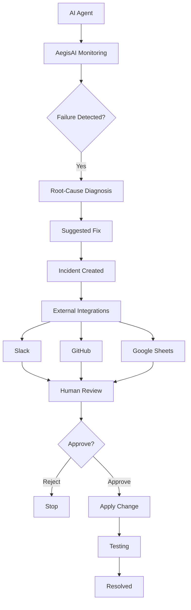
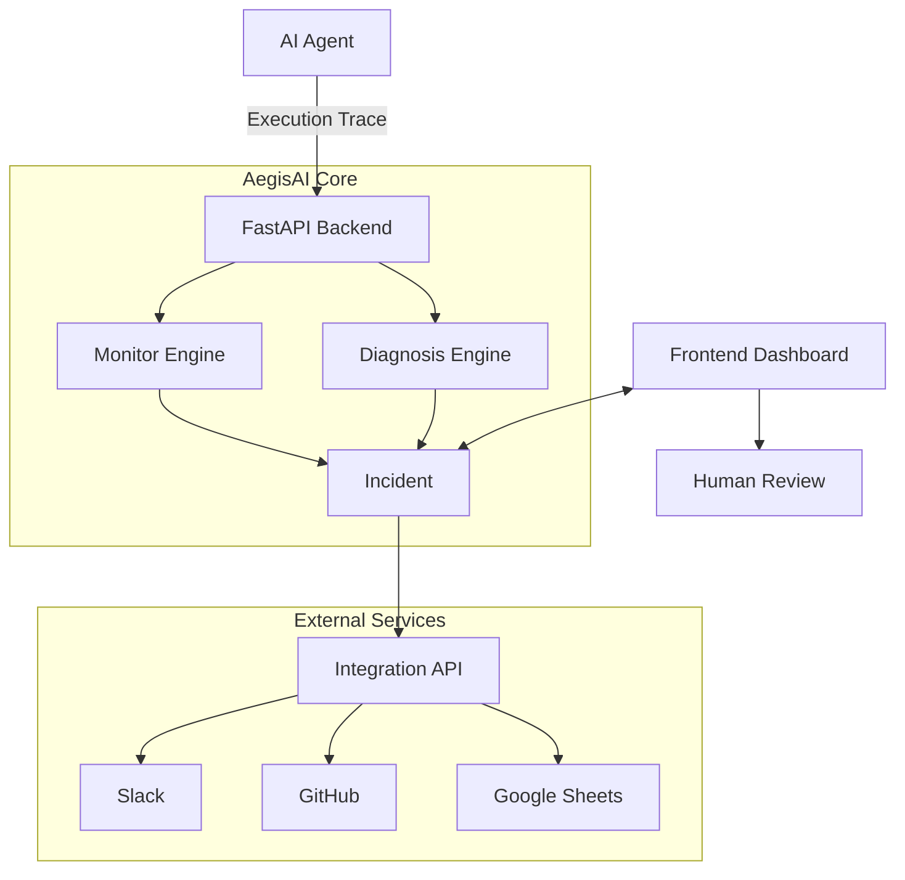
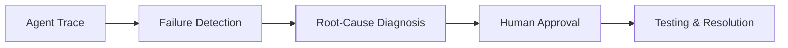

# AegisAI

[](https://aegis-ai-zv46.vercel.app/)
[](https://drive.google.com/file/d/1eI9j_FFeblRoL1ZvPHrk-JrvFtR78rWY/view?usp=sharing) 

## 1. What AegisAI Is

AegisAI is an autonomous reliability and incident-response system for AI agents.

It monitors an agent's execution trace, detects failures, diagnoses the root cause, generates a suggested fix, creates an incident, and connects the incident to engineering tools.

AegisAI also includes human approval before an approved fix is applied and tested.

The system detects five core failure types:

- `execution_loop`
- `incorrect_tool_usage`
- `instruction_violation`
- `hallucination`
- `task_incomplete`

The built-in `demo-research-agent-01` sends its execution trace through:

```text
POST /agent/trace
```

## 2. Complete Workflow / Architecture

AegisAI follows this workflow:



### System Architecture



## 3. Which External Agents / Services Were Used

AegisAI uses three external services:

- **Slack:** Used for real-time incident alerts, including failure type, severity, root cause, and suggested remediation.
- **GitHub:** Used for incident tracking and developer workflow, including issue creation and suggested fixes.
- **Google Sheets:** Used for incident history and audit logging, including timestamp, incident ID, agent ID, failure type, severity, status, and root cause.

## 4. How to Run AegisAI

### Live Deployment

AegisAI is deployed here:

[](https://aegis-ai-zv46.vercel.app/)

### Run Locally

Clone the repository:

```bash
git clone https://github.com/palakbhatt1/AegisAI.git
cd AegisAI
```

Start the backend:

```bash
cd backend
python3 -m venv venv
source venv/bin/activate
pip install -r requirements.txt
uvicorn app.main:app --host 0.0.0.0 --port 8000 --reload
```

Start the frontend in a second terminal:

```bash
cd frontend
npm install
npm run dev
```

Start the integration server from the repository root in a third terminal:

```bash
npm install
npm run dev
```

Run the interactive demo:

```bash
python orchestrate_demo.py --failure loop
```

Run the automated demo:

```bash
python orchestrate_demo.py --failure loop --auto-approve
```

Test the failure types:

```bash
python demo_agent.py --failure loop
python demo_agent.py --failure tool_error
python demo_agent.py --failure violation
python demo_agent.py --failure hallucination
python demo_agent.py --failure incomplete
```

Run the core tests:

```bash
python backend/test_core.py
```

## 5. How Reliability Is Checked

AegisAI uses four stages:



### Failure Detection

AegisAI uses deterministic rules to detect five failure types:

| Failure Type | Severity | Detection |
|---|---|---|
| `execution_loop` | HIGH | Same tool and input repeated 3+ times |
| `incorrect_tool_usage` | HIGH | Runtime, parameter, or schema error |
| `instruction_violation` | CRITICAL | Dangerous or prohibited tool input |
| `hallucination` | MEDIUM | Unknown or unregistered tool |
| `task_incomplete` | MEDIUM | Execution ends without completion |

### Root-Cause Diagnosis

For a detected failure, AegisAI identifies the problematic step, explains the root cause, and generates a suggested remediation.

### Human Approval

An engineer reviews the proposed fix and chooses:

```text
APPROVE or REJECT
```

Approved changes proceed to application and testing.

### Testing & Resolution

```text
Apply Change → Testing → Incident Updated → Resolved
```

The incident lifecycle is:

```text
Created → Notified → Under Review → Approved/Rejected → Applied → Tested → Resolved
```

## Two-Minute Demo

**Live Application:** [AegisAI](https://aegis-ai-zv46.vercel.app/)

**Two-Minute Demo Video:** Add the final two-minute demo video link here before submission.
