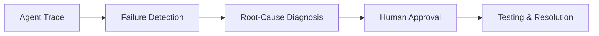

<div align="center">
  <h1>🛡️ AegisAI</h1>
  <p><strong>Autonomous reliability and incident response for the AI agent era.</strong></p>
  <a href="https://aegis-ai-zv46.vercel.app/">Live Application</a> • <a href="#two-minute-demo">Two-Minute Demo</a>
</div>

---

## 1. Project Overview

As companies deploy fleets of AI agents, keeping them reliable is a massive challenge. When agents fail—whether through hallucinations, infinite loops, or incorrect tool usage—they fail silently, breaking critical workflows. 

**AegisAI is an autonomous reliability and incident-response system for AI agents.** 

It continuously monitors an agent's execution trace, detects failures in real-time, diagnoses the root cause using an LLM, generates code-level fixes, and seamlessly connects the incident to your engineering tools. Before any fix is deployed, AegisAI enforces Human-in-the-Loop authorization to ensure maximum safety.

The system natively detects five core failure types:
- `execution_loop`
- `incorrect_tool_usage`
- `instruction_violation`
- `hallucination`
- `task_incomplete`

## 2. External Services & Integrations

AegisAI acts as the central command center for agent reliability by integrating directly into your existing developer workflows:

- **Slack:** Dispatches real-time incident alerts, including failure type, severity, root cause, and the suggested remediation.
- **GitHub:** Automatically drafts detailed issues for incident tracking, including the execution trace and the exact code diff required to fix the agent.
- **Google Sheets:** Maintains a persistent, exportable audit log of every incident (including timestamps, severity, and resolution status) for long-term reliability analytics.

## 3. Setup Instructions (How to Run)

### Live Deployment
AegisAI is fully deployed and accessible here:  
👉 **[Open AegisAI Dashboard](https://aegis-ai-zv46.vercel.app/)**

### Local Development
To run the full stack (Frontend, Backend, and Webhooks) locally:

1. **Clone the repository:**
   ```bash
   git clone https://github.com/palakbhatt1/AegisAI.git
   cd AegisAI
   ```

2. **Start the FastAPI Backend:**
   ```bash
   cd backend
   python3 -m venv venv
   source venv/bin/activate
   pip install -r requirements.txt
   uvicorn app.main:app --host 0.0.0.0 --port 8000 --reload
   ```

3. **Start the Vite Dashboard:**
   ```bash
   cd ../frontend
   npm install
   npm run dev
   ```

4. **Start the Next.js Integrations Server:**
   ```bash
   cd ..
   npm install
   npm run dev
   ```

## 4. How We Tested Reliability

AegisAI's reliability is tested through a strict, four-stage deterministic pipeline. We built a `demo-agent` capable of intentionally simulating failures to verify the system's response:



1. **Failure Detection:** We use hardcoded, deterministic rules to parse execution traces and classify failures with 100% accuracy (e.g., triggering `execution_loop` if the same tool and input are repeated 3+ times).
2. **Root-Cause Diagnosis:** The failing trace is passed to an LLM evaluator to pinpoint the exact broken step and generate a code diff.
3. **Human Approval:** To prevent destructive actions, the system pauses and requires a human engineer to review the proposed fix and click **APPROVE**.
4. **Resolution:** We built an end-to-end testing script (`orchestrate_demo.py`) that successfully simulates a failure, waits for authorization, and automatically applies a mock fix to verify the lifecycle.

## 5. Two-Minute Demo

Watch AegisAI autonomously detect, diagnose, and resolve an agent failure in our full video demo:

🎥 **[Insert Two-Minute Demo Video Link Here]**
